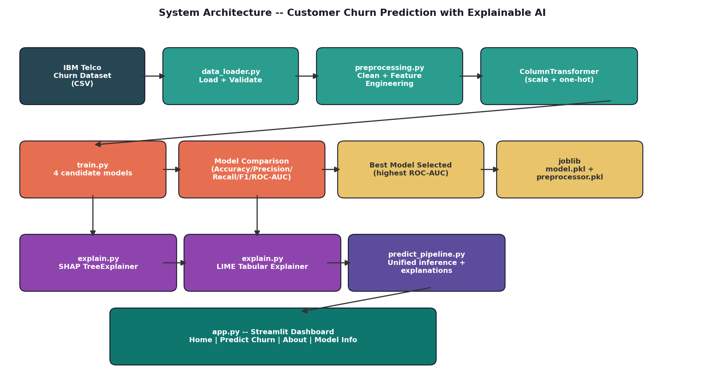
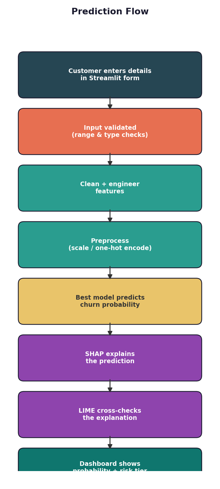
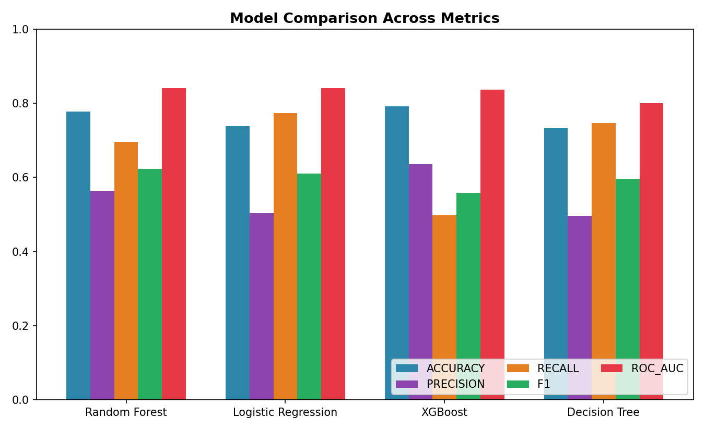
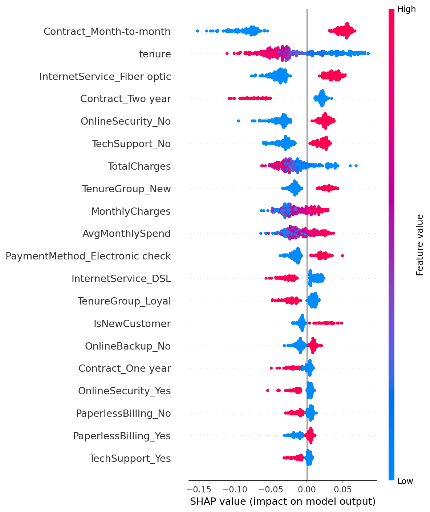

# 📡 Churn Radar -- Customer Churn Prediction with Explainable AI


An end-to-end, production-style machine learning system that predicts
whether a telecom customer will churn -- and explains **why**, for every
single prediction, using SHAP and LIME. Built on the IBM Telco Customer
Churn dataset.

---

## 🖼️ Screenshots

| Home | Prediction + Explanation |
|---|---|
| Dashboard overview with model KPIs and global churn drivers | Live churn probability, risk tier, SHAP bar chart, LIME cross-check |

> Run `streamlit run app.py` locally to view the live dashboard (see
> Installation below). Static chart exports are available in `assets/`.

---

## 🎯 Objective

Build a resume-worthy, modular, and deployable ML application that:
1. Predicts customer churn from historical account/service/billing data.
2. Explains every prediction at both the population level (SHAP summary /
   feature importance) and the individual level (SHAP waterfall + LIME).
3. Ships as an interactive Streamlit dashboard, not just a notebook.

## 🧱 Tech Stack

| Category | Tools |
|---|---|
| Language | Python 3.12+ |
| Data | pandas, numpy |
| Visualization | matplotlib, seaborn, plotly |
| Modeling | scikit-learn, XGBoost, LightGBM (optional) |
| Explainability | SHAP, LIME |
| App / Dashboard | Streamlit |
| Persistence | joblib |
| Testing | pytest |

## 📊 Dataset

**IBM Telco Customer Churn** -- 7,043 customers, 21 raw attributes
(demographics, subscribed services, contract & billing details), target
column `Churn` (Yes/No). See [`reports/eda_report.md`](reports/eda_report.md)
for the full exploratory analysis with charts and explanations.

## 🏗️ Project Structure

```
Customer-Churn-XAI/
├── data/                              # Raw dataset (CSV)
├── models/                            # Saved model, preprocessor, metadata (joblib/json)
├── notebooks/                         # Exploratory notebooks (optional)
├── src/
│   ├── config.py                      # Central paths & constants
│   ├── data_loader.py                 # Load & validate raw data
│   ├── eda.py                         # Exploratory Data Analysis + report generation
│   ├── preprocessing.py               # Cleaning, feature engineering, reusable pipeline
│   ├── train.py                       # Multi-model training, comparison, best-model selection
│   ├── explain.py                     # SHAP (global + local) and LIME explainability
│   ├── predict_pipeline.py            # Unified raw-input -> prediction + explanation entry point
│   └── utils/
│       └── logger.py                  # Shared logging configuration
├── tests/
│   └── test_pipeline.py               # Unit tests: data, preprocessing, prediction, invalid input
├── assets/                            # Generated charts (EDA, SHAP, architecture, flowchart)
├── reports/                           # EDA report + full project report
├── app.py                             # Streamlit dashboard
├── requirements.txt
├── .gitignore
└── README.md
```

## ⚙️ Architecture



Data flows one direction only: raw CSV → cleaning/feature engineering →
`ColumnTransformer` → model training/comparison → best model persisted with
`joblib` → explainability layer (SHAP/LIME) → Streamlit dashboard. The same
`preprocessing.py` module is used at both training time and inference time,
which eliminates train/serve skew.

## 🔄 Prediction Flow



## 🚀 Installation Guide

### 1. Clone and enter the project
```bash
git clone https://github.com/<your-username>/Customer-Churn-XAI.git
cd Customer-Churn-XAI
```

### 2. Create and activate a virtual environment
```bash
python3 -m venv venv

# macOS / Linux
source venv/bin/activate

# Windows
venv\Scripts\activate
```

### 3. Install dependencies
```bash
pip install -r requirements.txt
```

### 4. Place the dataset
Download the IBM Telco Customer Churn CSV and place it at:
```
data/WA_Fn-UseC_-Telco-Customer-Churn.csv
```

### 5. Run the pipeline
```bash
# 1. Exploratory Data Analysis (generates assets/ + reports/eda_report.md)
python -m src.eda

# 2. Train & compare models, auto-select the best one
python -m src.train

# 3. Generate global SHAP explainability charts
python -m src.explain

# 4. Run the test suite
pytest tests/ -v

# 5. Launch the dashboard
streamlit run app.py
```

The app will be available at `http://localhost:8501`.

## 📈 Model Performance

Four models are trained and automatically compared on Accuracy, Precision,
Recall, F1, and ROC-AUC; the highest ROC-AUC model is selected and persisted
automatically -- no manual model selection step.



| Model | Accuracy | Precision | Recall | F1 | ROC-AUC |
|---|---|---|---|---|---|
| **Random Forest** (selected) | 0.777 | 0.564 | 0.696 | 0.623 | **0.841** |
| Logistic Regression | 0.738 | 0.504 | 0.774 | 0.610 | 0.841 |
| XGBoost | 0.792 | 0.636 | 0.497 | 0.558 | 0.838 |
| Decision Tree | 0.732 | 0.496 | 0.747 | 0.597 | 0.801 |

*(Metrics regenerate automatically on every `python -m src.train` run.)*

## 🔍 Explainability

- **Global:** SHAP summary plot + mean |SHAP value| feature importance
  ranking, computed over a sample of the test set.
- **Local (per prediction):** SHAP waterfall plot showing exactly how each
  feature pushed one customer's score up or down from the model's base
  rate, plus an independent LIME local surrogate explanation as a
  cross-check.



## 🧪 Testing

18 unit tests cover data loading, cleaning/feature engineering, the
preprocessing pipeline, valid predictions, and **graceful handling of
invalid input** (missing fields, non-numeric values, out-of-range values).

```bash
pytest tests/ -v
```

## 🌱 Future Scope

- Swap the static CSV for a live data warehouse / CRM connection.
- Add a FastAPI inference service alongside the Streamlit UI for
  system-to-system integration.
- Introduce model monitoring (data drift, prediction drift) for production
  deployment.
- Add hyperparameter tuning (Optuna/GridSearchCV) and model versioning
  (MLflow) for a full MLOps loop.

## ✅ Applications

- Telecom / subscription-based retention teams prioritizing outreach.
- Any customer-facing subscription business (SaaS, insurance, banking)
  adapting the same pipeline to its own churn dataset.
- A reference implementation for pairing classical ML with production-grade
  explainability in a deployable app.

## 👍 Advantages

- Reusable, single-source-of-truth preprocessing shared by training and
  inference (no train/serve skew).
- Automatic, metric-driven model selection rather than a hardcoded choice.
- Every prediction is explained two independent ways (SHAP + LIME).
- Fully modular `src/` layout with type hints, docstrings, and logging.

## ⚠️ Limitations

- Trained on a single, moderately sized (7k-row) public dataset; production
  use requires retraining on the target business's own data.
- SHAP TreeExplainer is used for tree-based models; other model families
  fall back to a slower model-agnostic explainer.
- The Streamlit app is single-user / demo-oriented, not built for
  concurrent multi-tenant production traffic.

## 📄 License

Distributed under the MIT License. See [`LICENSE`](LICENSE) for details.

## 🙏 Acknowledgements

- Dataset: IBM Telco Customer Churn (originally published by IBM Cognos
  Analytics sample data).
- Libraries: scikit-learn, XGBoost, SHAP, LIME, Streamlit, and the broader
  Python data science ecosystem.
